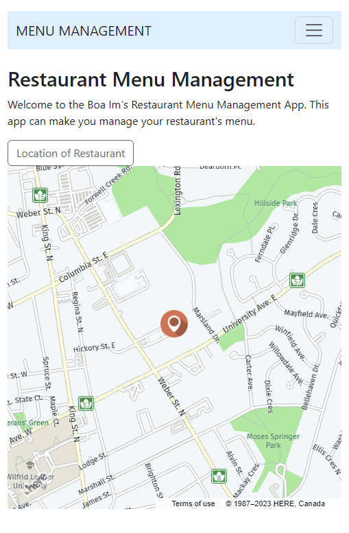
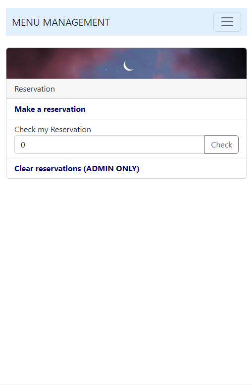
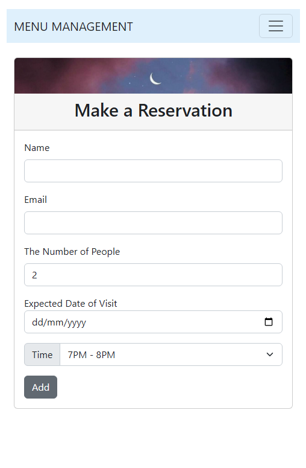
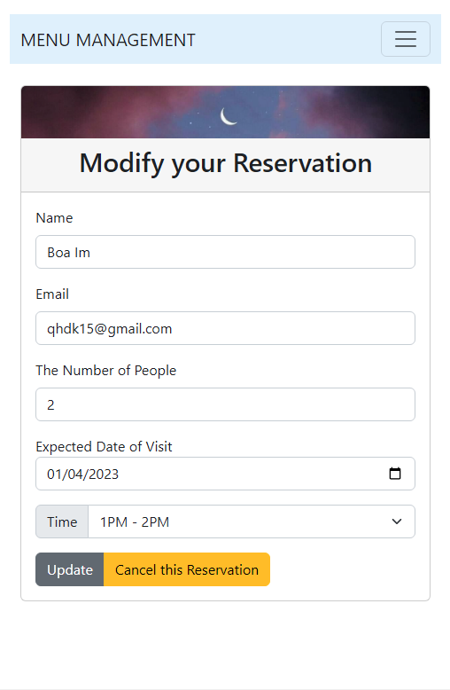
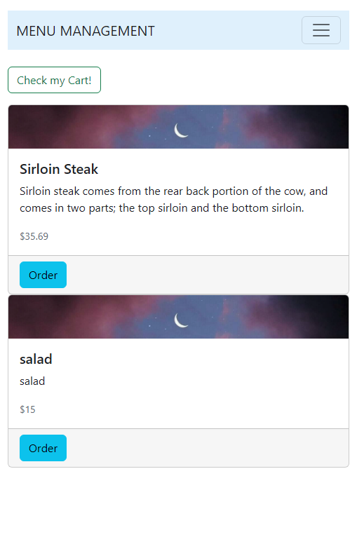
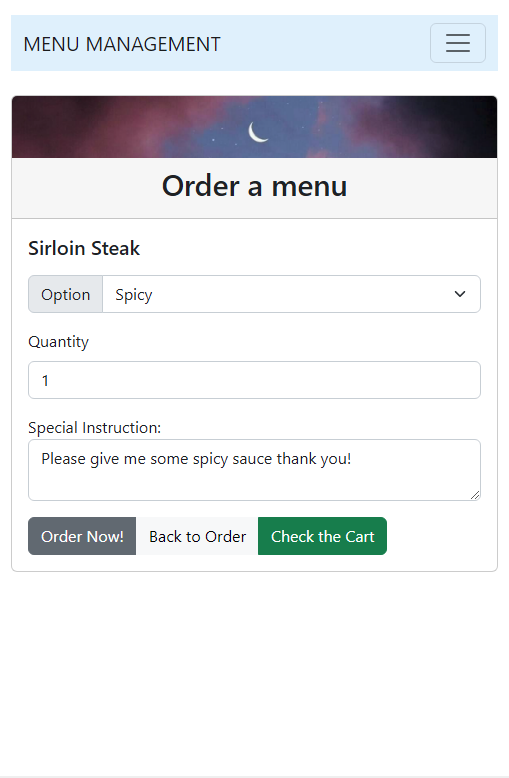
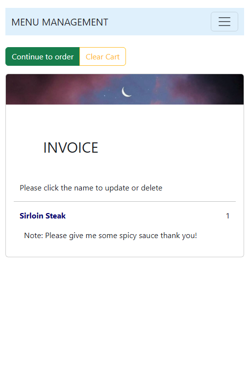
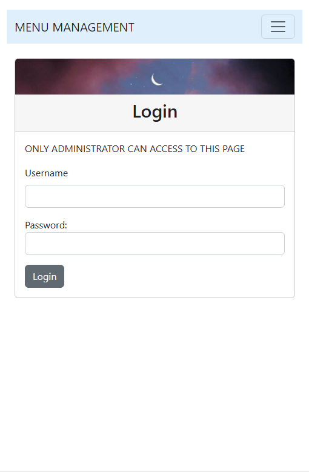
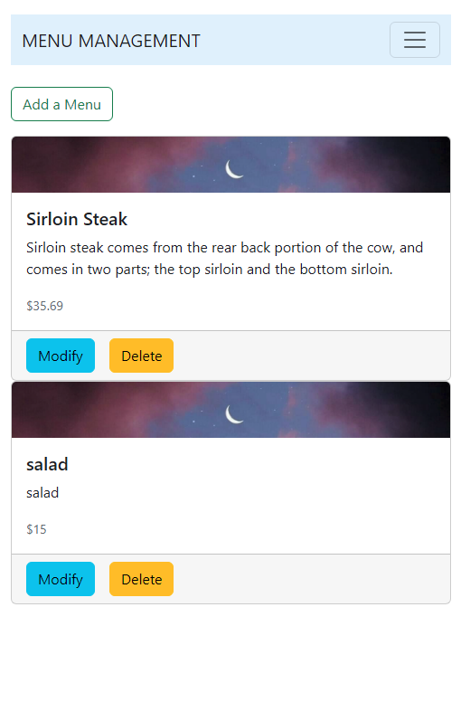
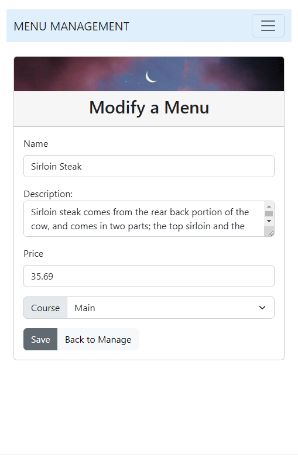

<h1>Menu Management App</h1>

This was made for a personal project to practice typescript.

<ul>
  <li>Build an <strong>Angular</strong> app for <strong>Android</strong> that allows restaurants to manage their menu and customers to order and make reservations</li>
  <li>Manage menus, orders, and reservations databases <strong>in Web SQL</strong> utilizing <strong>TypeScript</strong> and <strong>HTML</strong>, and design using <strong>Bootstrap</strong></li>
  <li>Use google map API to show the map by geolocation</li>
</ul>
<h5>How to run this code?</h5>

You should have Angular, JDK 8, and node.js
   Run the code and go to localhost:4200(This is defualt port. If you change the port number, it should be different

  <h4>1. Home page</h4>
  
  
You can see the menu toggle and the map button to see the restaurant's location by API

  <h4>2. Reservation page</h4>
  
  
You can make a new reservation by clicking the first list
   You can check your reservation time to edit or cancel
   If you are the manager, you can clear every reservation by logging in

  <h4>3. Make Reservation Page</h4>
  
  
You can make a new reservation by entering your information
   The time list is came from database of application
     You will get your order number for checking, modifying, or deleting your reservation

  <h4>4. Modify Reservation Page</h4>
  
  
You can modify your reservation or delete the reservation after entering your order number in reservation page

  <h4>5. Display Menu Page</h4>
  
  
You can see the menus that the restaurant is serving

  <h4>6. Order a Menu Page</h4>
  
  
You can order a menu with special instruction and option

  <h4>7. Invoice(Cart) Page</h4>
  
  
There are menus that you ordered
   You can change the instruction and option by clicking the name of the menu

  <h4>8. Login Page</h4>
  
  
You have to login as an administrator to manage your restaurant's menus
     ID: admin
     PW: admin (hope to help you understand this application's structure)
  

  <h4>9. Manage Menus Page</h4>
  
  
You can add a new menu or modify/delete the menu

  <h4>10. Modify a Menu Page</h4>
  
  
You can change the name/description/price of the menu that you selected

